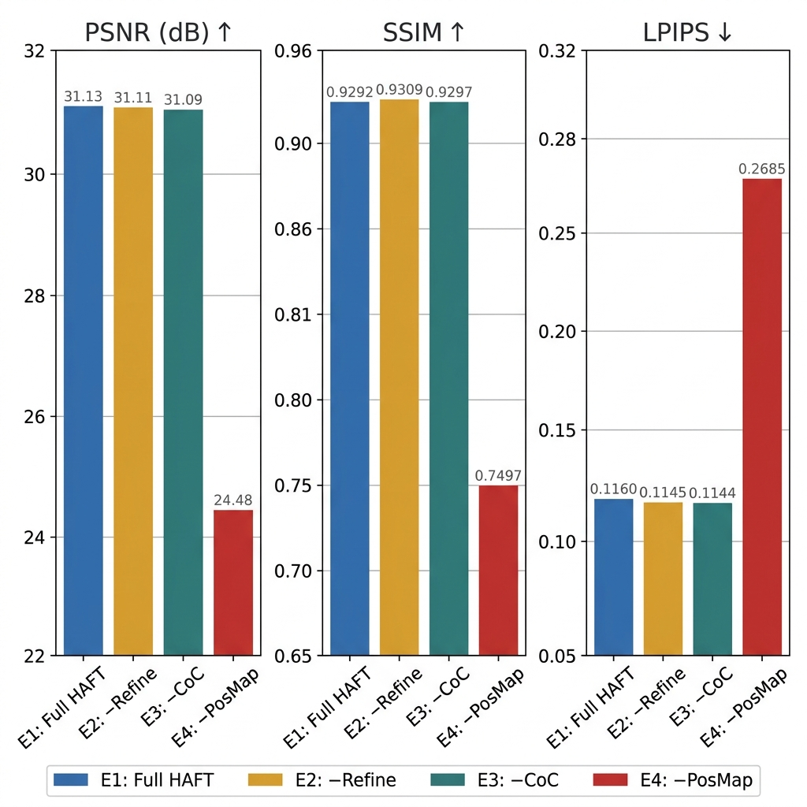
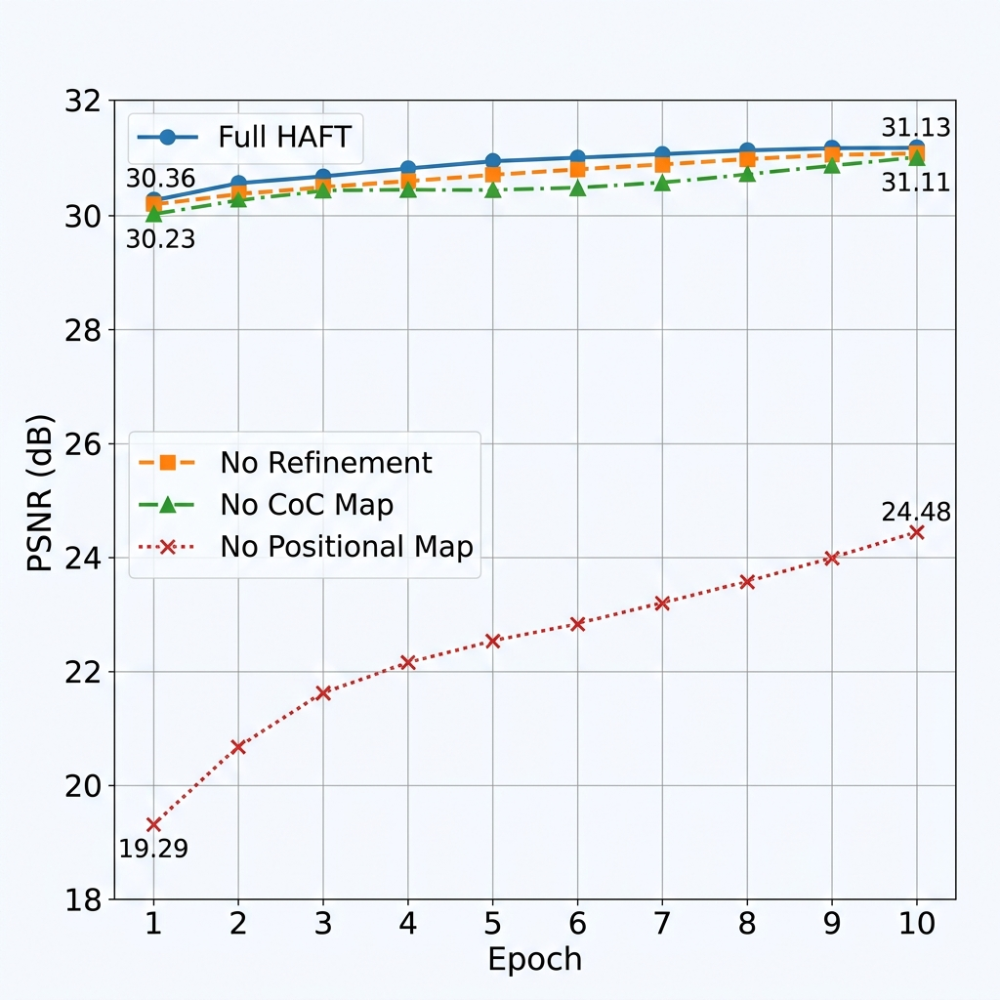

# Ablation Study — HAFT (NTIRE 2026 CABR Challenge)

**Team:** CV SVNIT &nbsp;·&nbsp; **Dataset:** RealBokeh_3MP &nbsp;·&nbsp; **GPU:** Tesla T4 (15.6 GB) &nbsp;·&nbsp; **Epochs:** 10 per variant

---

## What We Ablate

HAFT adds three conditioning modules on top of the Bokehlicious backbone. We remove one at a time to measure each component's contribution:

| Module | What it does |
|--------|-------------|
| **Positional Map** | 2-D sinusoidal spatial encoding injected at every encoder/decoder stage — gives the network explicit pixel-location priors at all scales |
| **CoC Map** | Physics-based per-pixel Circle-of-Confusion radius computed from depth + aperture — explicit spatially-resolved blur prior |
| **Refinement Head** | Depth-guided residual branch that corrects fore/background transition artifacts |

---

## Experiments

| # | Variant | Refinement | CoC Map | Positional Map |
|---|---------|:----------:|:-------:|:--------------:|
| **E1** | **Full HAFT** *(ours)* | ✅ | ✅ | ✅ |
| E2 | w/o Refinement Head | ❌ | ✅ | ✅ |
| E3 | w/o CoC Map | ✅ | ❌ | ✅ |
| E4 | w/o Positional Map | ✅ | ✅ | ❌ |

All other settings are **identical**: same learning rates, same Charbonnier-FFT-LPIPS composite loss, same 80-train / 14-test RealBokeh_3MP split.

---

## Results

Metrics reported at **best validation checkpoint** over 10 epochs on the RealBokeh_3MP test split (14 images).

| Variant | PSNR (dB) ↑ | SSIM ↑ | LPIPS ↓ | ΔPSNR |
|---------|:-----------:|:------:|:-------:|:-----:|
| **E1 — Full HAFT** | **31.13** | 0.9292 | 0.1160 | — |
| E2 — w/o Refinement | 31.11 | **0.9309** | **0.1145** | −0.02 |
| E3 — w/o CoC Map | 31.09 | 0.9297 | 0.1144 | −0.04 |
| **E4 — w/o Positional Map** | **24.48** | **0.7497** | **0.2685** | **−6.65** |



---

## Findings

**Positional Map is load-bearing.**
Removing it collapses PSNR by **−6.65 dB** and SSIM from 0.929 to 0.750. The model's initial train loss jumps from ~0.05 to 0.21, confirming it starts in a fundamentally worse optimisation landscape. At 3 MP resolution, the network cannot recover spatial structure from appearance alone.

**CoC Map provides a useful physics prior.**
Without it, PSNR drops −0.04 dB. The aperture-FiLM embedding partially compensates, but the CoC Map's spatially-resolved blur radius matters most for scenes with strong depth variation.

**Refinement Head trades PSNR for perceptual quality.**
E2 (no refinement) scores marginally better SSIM and LPIPS, but is visually weaker at in-focus/out-of-focus boundaries — where pixel-level metrics are unreliable. We keep the refinement head for final submission.

---

## Training Curves

Per-epoch validation PSNR across all variants:



E1–E3 converge tightly between 31.0–31.1 dB. E4 plateaus near 24.5 dB, confirming the positional map's role is irreplaceable.

---

## Reproduce

### Files in this folder

| File | Purpose |
|------|---------|
| [`notebooks/HAFT_Ablation_Study.ipynb`](notebooks/HAFT_Ablation_Study.ipynb) | Complete unified Kaggle notebook for all 4 ablation experiments (E1–E4) |
| [`run_ablation.py`](run_ablation.py) | Trains all 4 variants sequentially via CLI, writes `results/ablation_results.md` |
| [`plot_results.py`](plot_results.py) | Generates the bar chart + convergence figures from the logged numbers |
| `results/` | Pre-generated figures and the markdown summary table |

### Run the experiments

```bash
# From the HAFT FACTSHEET/ directory:
python ablation/run_ablation.py
```

Trains E1 → E2 → E3 → E4 in order (each ~10 epochs on T4).  
Writes a summary to `ablation/results/ablation_results.md`.

The training flags consumed by `train_haft_small.py`:

| Flag | Effect |
|------|--------|
| *(none)* | Full HAFT — all modules enabled |
| `--no_refinement` | Disables the depth-guided Refinement Head |
| `--no_coc` | Disables the Circle-of-Confusion Map input |
| `--no_pos` | Disables the Positional Map at all encoder/decoder stages |

### Regenerate the figures

```bash
# Requires: pip install matplotlib numpy
python ablation/plot_results.py
```

Overwrites `results/ablation_metrics.png` and `results/ablation_convergence.png`.

### Kaggle notebooks (original runs)

The numbers reported here come from two Kaggle executions:
- **E1, E2, E3** → `exp 1,2 ,3 results/exp 1,2,3.ipynb`
- **E4** → `exp 4 results/exp 4 abletation study.ipynb`

> Results may vary ±0.1 dB across runs due to CUDA non-determinism (seed not fixed).
